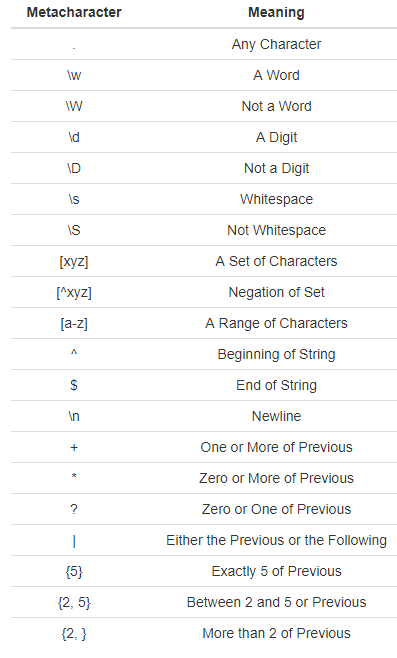

# Fonction R à connaitre 

* [RCheatSheets : [link](https://www.rstudio.com/resources/cheatsheets/)](#rcheatsheets----link--https---wwwrstudiocom-resources-cheatsheets--)
* [General](#general)
    - [Data Structure](#data-structure)
    - [Boolean](#boolean)
    - [Sample](#sample)
    - [Workspace and Files](#workspace-and-files)
    - [Regular expression](#regular-expression)
    - [String package](#string-package)
* [Tidyverse](#tidyverse)
    - [Read csv file `readr`](#read-csv-file--readr-)
    - [Explore data](#explore-data)
    - [Lubridate](#lubridate)
    - [Purr](#purr)
* [Debugging, profiling, non standard evaluation](#debugging--profiling--non-standard-evaluation)
    - [Debugging](#debugging)
    - [Profiling](#profiling)
    - [Evaluation non standard](#evaluation-non-standard)
* [OOP](#oop)
    - [S3](#s3)
      * [Class and object definition](#class-and-object-definition)
      * [Method definition](#method-definition)
    - [S4](#s4)
      * [Class definition](#class-definition)
      * [Object definition](#object-definition)
      * [Method definition](#method-definition-1)
    - [Reference Classes](#reference-classes)
      * [Class definition](#class-definition-1)
      * [Object definition](#object-definition-1)
* [Packages](#packages)
    - [Dependances](#dependances)
    - [Devtools](#devtools)
      * [Documentation](#documentation)
      * [Include data in a package](#include-data-in-a-package)
      * [Testthat](#testthat)
      * [Save data on a user machine](#save-data-on-a-user-machine)
      * [Environmental attributes](#environmental-attributes)
* [Renv](#renv)
* [Requesting Data from API](#requesting-data-from-api)
* [Code Parallelization](#code-parallelization)
  + [`Parallel`, `foreach`, `doParallel` package](#-parallel----foreach----doparallel--package)
  + [Future](#future)
* [Leaflet](#leaflet)

## RCheatSheets : [link](https://www.rstudio.com/resources/cheatsheets/)

## General

#### Data Structure

- vector `c`
- matrix `matrix`
- dataframe `data.frame`
  - `colnames` function
  - `dim`

#### Boolean

`any` /`all` /`which`

`identical`

`isTRUE`

#### Sample

`sample`

`rnorm`

#### Workspace and Files

`getwd` / `setwd`

`ls`

`list.files` / `dir`

`dir.create`

`file.create`/ `file.exists`/ `file.info` / `file.rename` / `file.copy` / `file.remove` / `file.path`

#### Regular expression

`grepl` -> evaluate if regex in string (or vector of string)

`grep` -> get index of string that contains regex

`sub(regex, replacement, string)`-> replace **1st** instance of regex in string

`gsub(regex, replacement, string)`-> replace **all** instance of regex in string

`strsplit(string, regex)`



#### String package 

functions argument are usually `(string, regex)`

`str_extract`/`str_order`/`str_pad`/`str_to_title`/ `str_trim`

`word(string, i)` -> get i_th_ word in string 

## Tidyverse

#### Read csv file `readr`

`read_csv`

#### Explore data 

`summary`

`table`

`str`

#### Lubridate

`with_tz(datetime, tzone)`

#### Purr

`map` --> list

`map_chr`/`map_lgl` /`map_dbl` --> vector

`map_if` / `map_at`

`map2` family

`reduce`

`has_element` : verify if predicate apply on at least an element of list

`detect` : get first element that verifies a predicate

`detect_index`

`keep`  / `discard` : get / remove element that verifies a predicate

`every` /`some`: like all and any

`partial` : like partial in python

`walk` : apply a function sequentially on element of structure

## Debugging, profiling, non standard evaluation

#### Debugging

`traceback`

`browser` / `trace`

`debug`/`debugonce` equivalent to `trace(f, browser)`

recover option : `option(error=recover)` to open a browser when an error is detected

#### Profiling

Voir package `microbenchmark` et `profvis`

#### Evaluation non standard

Lié à l'environnement tidyverse

## OOP

#### S3

##### Class and object definition

``````R
# Assigning a new class to an object
special_num_1 <- structure(1, class = "special_number")

# Definition of a constructor fonction
my_class <- function(x){
  structure(x, class = "my_class")
}

# New object using the constructor
my_obj <- shape_s3(...)

# Check inheritance
inherits(my_obj, "my_class")
``````

##### Method definition

``````R
# Create a generic method
my_method<- function(x) UseMethod("my_method")

# Define the method
my_method.my_class <- function(x){
  ...
}

# Use the method
my_method(my_obj)
``````

#### S4

##### Class definition

```R
setClass("bus_S4",
         slots = list(n_seats = "numeric", 
                      top_speed = "numeric",
                      current_speed = "numeric",
                      brand = "character")) # slots are attributes of the class
setClass("party_bus_S4",
         slots = list(n_subwoofers = "numeric",
                      smoke_machine_on = "logical"),
         contains = "bus_S4") # contains is optional
```

##### Object definition

```R
my_bus <- new("bus_S4", n_seats = 20, top_speed = 80, 
              current_speed = 0, brand = "Volvo")
# to access an attribute
my_bus@n_seats
```

##### Method definition 

```R
# Define a generic function
setGeneric("new_generic", function(x){
  standardGeneric("new_generic")
})

# Make a method generic to define a special version for a class
setGeneric("existing_generic")
```

```R
# Define the function in the context of a class
setMethod("new_generic",
          c(x = "bus_S4"), # specify the class of each argument
          function(x){
            x@current_speed > 0
          } # Function definition
         )
```

#### Reference Classes

Very similar to how python works

##### Class definition

```R
Student <- setRefClass("Student",
                      fields = list(name = "character",
                                    grad_year = "numeric",
                                    credits = "numeric",
                                    id = "character",
                                    courses = "list"),
                      methods = list(
                        hello = function(){
                          paste("Hi! My name is", name)
                        },
                        add_credits = function(n){
                          credits <<- credits + n
                        },
                        get_email = function(){
                          paste0(id, "@jhu.edu")
                        }
                      ))

# Children class with key contains
Grad_Student <- setRefClass("Grad_Student",
                            contains = "Student",
                            fields = list(thesis_topic = "character"),
                            methods = list(
                              defend = function(){
                                paste0(thesis_topic, ". QED.")
                              }
                            ))
```

##### Object definition

```R
brooke <- Student$new(name = "Brooke", grad_year = 2019, credits = 40,
                    id = "ba123", courses = list("Ecology", "Calculus III"))

#Access attributes and methods using $
brooke$credits
brooke$hello()
```

## Packages

#### Dependances

`require` : load a pckage and retur a boolean indicating if success

#### Devtools


##### Documentation

- *ReadME*: Markdown file for github

- *Vignette*: RMarkdown file to use a tutorial and demonstrator in a package based on knitr. See [knit common options](https://bookdown.org/rdpeng/RProgDA/documentation.html#common-knitr-chunk-options)

- *Help Files* : include the documentation of each exported function just above the function definition using `roxygen2` by commenting using `#'` and [roxygen tags](https://bookdown.org/rdpeng/RProgDA/documentation.html#common-roxygen2-tags) and [roxygen formatting](https://bookdown.org/rdpeng/RProgDA/documentation.html#common-roxygen2-formatting-tags):

``````R
#' Print "Hello world" 
#'
#' This is a simple function that, by default, prints "Hello world". You can 
#' customize the text to print (using the \code{to_print} argument) and add
#' an exclamation point (\code{excited = TRUE}).
#'
#' @param to_print A character string giving the text the function will print
#' @param excited Logical value specifying whether to include an exclamation
#'    point after the text
#' 
#' @return This function returns a phrase to print, with or without an 
#'    exclamation point added. As a side effect, this function also prints out
#'    the phrase. 
#'
#' @examples
#' hello_world()
#' hello_world(excited = TRUE)
#' hello_world(to_print = "Hi world")
#'
#' @export
hello_world <- function(to_print = "Hello world", excited = FALSE){
    if(excited) to_print <- paste0(to_print, "!")
    print(to_print)
}
``````

##### Include data in a package

- Include the data in the global environment by using devtools `use_data(maple)`. To hide this data from the user package use the option `internal=TRUE`

- Document the exported data by creating a `data.R` file in the R/ directory :

 ```````R
 #' Production and farm value of maple products in Canada
 #'
 #' @source Statistics Canada. Table 001-0008 - Production and farm value of
 #'  maple products, annual. \url{http://www5.statcan.gc.ca/cansim/}
 #' @format A data frame with columns:
 #' \describe{
 #'  \item{Year}{A value between 1924 and 2015.}
 #'  \item{Syrup}{Maple products expressed as syrup, total in thousands of gallons.}
 #'  \item{CAD}{Gross value of maple products in thousands of Canadian dollars.}
 #'  \item{Region}{Postal code abbreviation for territory or province.}
 #' }
 #' @examples
 #' \dontrun{
 #'  maple
 #' }
 "maple"
 ```````

- Raw data : create a directory named ` inst/extdata` and include the raw data files. A use can access the data by using : `system.file("extdata", "response.json", package = "mypackage") `.


##### Testthat


``````R
library(testthat)
# Use expect_that to test one result 
expect_that(sqrt(3) * sqrt(3), equals(3))

# Use test_that for multiple calls to expect_that
test_that("model fitting", {
        data(airquality)
        fit <- lm(Ozone ~ Wind, data = airquality)
        expect_that(fit, is_a("lm"))
        expect_that(1 + 1, equals(2))
})

# Use test_file or test_dir to test a file or a set of test files in a directory
test_file("my_test.R")
test_dir("test/")

``````

##### Save data on a user machine

``````R
save_file_with_authorization <- function(force = FALSE){
  if(!dir.exists(file.path("~", "Desktop"))){
    warning("No Desktop found.")
  } else {
    if(!force && interactive()){
      result <- select.list(c("Yes", "No"), 
                  title = "May this program create data.txt on your desktop?")
      if(result == "Yes"){
        file.create(file.path("~", "Desktop", "data.txt"))
      }
    } else if(force){
      file.create(file.path("~", "Desktop", "data.txt"))
    } else {
      warning("data.txt was not created on the Desktop.")
    }
  }
}
``````

##### Environmental attributes

See `.Machine` and `.Platform` attributes

## Renv

`renv::init()`

`renv::snapshot()`

`renv::restore()`

## Requesting Data from API

[httr docs](https://cran.r-project.org/web/packages/httr/vignettes/quickstart.html)

``````R
# load packages
library(dplyr)
library(rjson)
library(jsonlite)
library(httr)

base_url <- "https://data.colorado.gov/resource/j5pc-4t32.json?"
full_url <- paste0(base_url, "station_status=Active",
            "&county=BOULDER")
r <- GET(full_url)
response_content <- content(r, "text")
# you can then pipe this
water_data_df <- fromJSON(response_content) %>%
  flatten(recursive = TRUE) # remove the nested data frame
``````

## Code Parallelization 

### `Parallel`, `foreach`, `doParallel` package

[Tutorial](https://nceas.github.io/oss-lessons/parallel-computing-in-r/parallel-computing-in-r.html)

``````R
library(parallel)
numCores <- detectCores()*
vec <- c(...)
func <- function(x){...}
results <- mclapply(vec, fx, mc.cores = numCores)
``````

``````R
library(foreach)
library(doParallel)
registerDoParallel(numCores)
foreach (i=1:3) %dopar% {
  sqrt(i)
}

# Return a vector
foreach (i=1:3, .combine=c) %dopar% {
  sqrt(i)
}

# When you're done, clean up the cluster
stopImplicitCluster()
``````

### Future

See [Link](https://cran.r-project.org/web/packages/future/vignettes/future-1-overview.html)

## Leaflet

https://rstudio.github.io/leaflet/json.html

